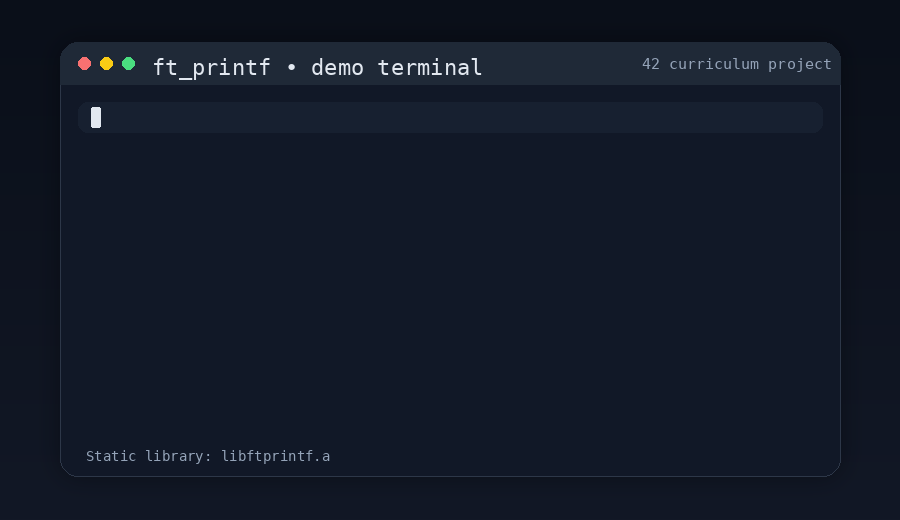

*This project has been created as part of the 42 curriculum by vdiez-cu.*

# ft_printf 🖨️

[](https://en.wikipedia.org/wiki/C_(programming_language))
[](https://en.wikipedia.org/wiki/Unix)
[](https://www.42.fr/)
[](LICENSE)

> A 42 school project: Reimplementing `printf()` as a static library in C.

---

## 📌 Description

`ft_printf` is a C project that reimplements the standard `printf()` function from the C library. The result is packaged as a static library (`libftprintf.a`) that can be linked into any future C project.

The core challenge is handling a **variable number of arguments** using variadic functions (`va_list`, `va_start`, `va_arg`, `va_end`), and correctly formatting and printing each type of argument.

This project teaches:

- How variadic functions work in C and when to use them.
- Parsing a format string and dispatching to type-specific output functions.
- Managing return values: `ft_printf` returns the total number of characters written, mirroring the original.
- Building and linking a static library with `ar`.

---

## 🎬 Demo

<p align="center">
  
</p>

---

## 🧠 Algorithm & Design Choices

### Format string parsing

`ft_printf` iterates over the format string character by character. When it encounters a `%`, it advances one position and calls `ft_choose_type` with the next character and the `va_list`. Any other character is written directly to stdout via `ft_putchar`.

```text
ft_printf(format, ...)
│
├─ va_start(arg, format)
│
└─ For each character in format:
    ├─ If '%' → advance, call ft_choose_type(next_char, arg)
    └─ Else   → ft_putchar(c)
│
└─ va_end(arg), return total chars written
```

### Type dispatch (`ft_choose_type`)

A single function with a chain of `if/else if` branches routes each format specifier to its dedicated handler. This keeps the logic flat and easy to extend:

| Specifier | Handler | Notes |
|-----------|---------|-------|
| `%c` | `ft_putchar` | Cast `int` arg to `char` |
| `%s` | `ft_str_s` | Prints `(null)` if pointer is NULL |
| `%p` | `ft_str_ptr` | Prints `(nil)` if NULL, otherwise `0x` + lowercase hex |
| `%d` / `%i` | `ft_putnbr` | Handles `INT_MIN` explicitly to avoid overflow |
| `%u` | `ft_putnbr_unsigned` | Separate recursive function for unsigned |
| `%x` | `ft_putnbr_hex` | Lowercase hex via `"0123456789abcdef"` lookup |
| `%X` | `ft_putnbr_hex_up` | Uppercase hex via `"0123456789ABCDEF"` lookup |
| `%%` | `ft_putchar('%')` | Literal percent sign |

### Number-to-string conversion

All numeric converters are **recursive**: they divide by their base, recurse on the quotient, then print the remainder. This naturally produces digits in the correct left-to-right order without needing a temporary buffer or reversal. Every call returns the number of characters it wrote, making it trivial to accumulate the total count.

`INT_MIN` (`-2147483648`) is handled as a special case in `ft_putnbr` because negating it in `int` would overflow — the sign and the digits `2147483648` are printed separately.

### Why a static library?

The subject requires building `libftprintf.a` with `ar rcs`. A static library bundles the compiled object files so that any project can link against it at compile time (`-L. -lftprintf`) without needing the source files. This is the canonical way to distribute reusable C code at 42, and once completed, `ft_printf` can be added directly to your `libft`.

### Why no buffer management?

The original `printf()` uses an internal buffer to batch writes and reduce system calls. The subject explicitly forbids reimplementing this, so each character is written immediately via `write(1, &c, 1)`. This is simpler and correct for all required conversions.

---

## 💡 Features

### Supported conversions

| Specifier | Description |
|-----------|-------------|
| `%c` | Single character |
| `%s` | String — prints `(null)` if the pointer is NULL |
| `%p` | Pointer address in lowercase hex with `0x` prefix — prints `(nil)` if NULL |
| `%d` | Signed decimal integer |
| `%i` | Signed integer in base 10 |
| `%u` | Unsigned decimal integer |
| `%x` | Unsigned integer in lowercase hexadecimal |
| `%X` | Unsigned integer in uppercase hexadecimal |
| `%%` | Literal percent sign |

### Return value

`ft_printf` returns the **total number of characters written** to stdout, exactly like the original — useful for error checking and composing output.

---

## ⚙️ Instructions

### Requirements

- Unix-based OS (Linux / macOS)
- GCC or Clang
- `make` utility
- `ar` (standard on all Unix systems)

### Build the library

```bash
git clone <repository_url>
cd ft_printf
make
```

This produces `libftprintf.a` in the current directory.

### Makefile rules

| Rule | Description |
|------|-------------|
| `make` / `make all` | Compile and archive the library |
| `make clean` | Remove object files |
| `make fclean` | Remove objects and `libftprintf.a` |
| `make re` | Full recompile |

### Link it into your project

```bash
cc -Wall -Wextra -Werror your_file.c -L. -lftprintf -o your_program
```

Or add it to your own Makefile:

```makefile
LIBS = -L./ft_printf -lftprintf
```

Then include the header in your source files:

```c
#include "ft_printf.h"

int main(void)
{
    ft_printf("Hello, %s! You are %d years old.\n", "world", 42);
    return (0);
}
```

---

## 📂 File Structure

| File | Description |
|------|-------------|
| `ft_printf.c` | Core function: format string parser, type dispatcher, pointer and string handlers |
| `ft_printf_utils.c` | Output primitives: `ft_putchar`, `ft_putnbr`, `ft_putnbr_unsigned`, `ft_putnbr_hex`, `ft_putnbr_hex_up` |
| `ft_printf.h` | Header — includes and function prototypes |
| `Makefile` | Build rules — produces `libftprintf.a` via `ar rcs` |

---

## 📚 Resources

### References

- [`printf` — Linux man page](https://man7.org/linux/man-pages/man3/printf.3.html)
- [Variadic functions in C — `<stdarg.h>` — cppreference](https://en.cppreference.com/w/c/variadic)
- [`ar` utility — GNU Binutils](https://sourceware.org/binutils/docs/binutils/ar.html)
- [Static libraries in C — GeeksforGeeks](https://www.geeksforgeeks.org/static-vs-dynamic-libraries/)
- [The C Programming Language — Kernighan & Ritchie](https://en.wikipedia.org/wiki/The_C_Programming_Language)

### 🤖 AI Assistance

AI was used for:
- Structuring and wording this README
- Reviewing the algorithm documentation for clarity and completeness

No AI was used for actual code implementation.

---

## 🤝 Contributing

1. Fork the repository
2. Create a new branch (`git checkout -b feature/your-feature`)
3. Make your changes
4. Commit (`git commit -m 'Add feature'`)
5. Push (`git push origin feature/your-feature`)
6. Open a Pull Request

---

## 📜 License

This project is licensed under the MIT License — see the [LICENSE](LICENSE) file for details.
